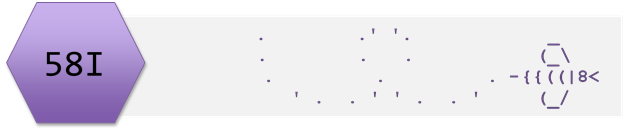

```{r setup, include=FALSE}
knitr::opts_chunk$set(echo = FALSE,
                      message = FALSE,
                      warning = FALSE,
                      include = FALSE)
```

```{r pkgs}
library(ggplot2)
```  

# Introduction

## Aims
In the third of three related workshops we will learn to apply and interpret the glm() function to binary (binomial) response data.

## Objectives 
By actively following the first lecture, working through workbook examples during the workshop workshop and any completing follow-up independent study the successful student will be able to:

* Explain the link between the general linear models and the generalised linear model
* Recognise where a generalised linear model for binomially distributed data would be appropriate and apply `glm()`
* Determine which effects are significant using using `summary()` and `anova()`

You can optionally stretch yourself by asking for more in-depth explanations about the meaning of the estimates, and the direction and magnitude of the effects or creating figures to go with your analyses. Biomedical Scientists might be particularly interested in binomial glm estimates ('odds ratios').


# Workbook Instructions

The workbook for this session is divided in to 2 sections. 

**You are not expected do all of the workbook examples**

Choose **one** from each section that best matches your biological interests. For each example you choose, you should:

* write comments in your scripts!
* read in the data file
* check you understand the structure of the data
* identify the response and explanatory variables
* build a model with `glm()`
* examine the model result using `summary()` and `anova()`
* what are the model estimates?
* interpret the results - you might find it helpful to use `predict()`  
* use `plot(mod, which = 1)` and `plot(mod, which = 2)` to examine the assumptions

Optional Extension: Practice your plotting skills.


## Section 1

**Choose one of:**

----------------------------------------

### Wolf Spiders

This example concerns the effect of sand grain size on the presence of wolf spiders.
Suzuki et al. (2006) measured sand grain size on 28 beaches in Japan and observed the presence or absence of the burrowing wolf spider _Lycosa ishikariana_ on each beach. The data are in [grainsize.txt](../data/grainsize.txt). Can you predict the presence of spiders from the sand grain size? 

```{r echo=FALSE,results="hide",warning=FALSE,message=FALSE,eval=FALSE}
#============== WORKBOOK EXAMPLE ==============#
# The effect of sand grain size on the presence of wolf spiders

# read in the data file
grainsize <- read.table("../data/grainsize.txt", header = T)
# check you understand the structure of the data
str(grainsize)
# it has 28 observations and 2 variable, one is a factor, the other a number

# identify the response and explanatory variables
# the response is 'spiders' a binary variable that indicates 
# whether a spider is present or not; gsize is the explanatory variable

# build a model with `glm()`
# binary outcome so it is binomial
mod <- glm(data = grainsize, spiders ~ gsize, family = binomial)


# examine the model result using `summary()` and `anova()`
# what are the model estimates?
summary(mod)
anova(mod, test = "Chisq")
levels(grainsize$spiders) # tells us what the intercept relates to (first level)
# the intercept is the log odds of spiders being present over absent when grainsize is zero
# that it is negative means the odds are less than 1 which means the probability of present is less than the probability of not being present at grain size of zero
# the 'slope' is the change in log odds of spiders being present over absent with each unit of grainsize
# that it is positive means odds of being present increase
# this model explains a significant amount of variation in the presence of spiders

# interpret the results - you might find it helpful to use `predict()`

exp(mod$coefficients)  # antilogs so the intercept odds of spiders being present over absent when grainsize is zero 

# odds can be tricky!
newdat <- data.frame(gsize = seq(0, 1))
newdat
newdat$pr <- predict(mod, type = "response", newdata = newdat)
newdat
# the probability of a spider being present when grain size is 0 is 0.1614302
# the probability of a spider being not present when grain size is 0 is 1 - 0.1614302
# thus the odds of being present over absent are 0.1614302/(1-0.1614302) = 0.1925066
# 0.1925066 is exp(mod$coefficients[1])

# the probability of a spider being present when grain size is 1 is 0.9699368
# the probability of a spider being not present when grain size is 1 is 1 - 0.9699368
# thus the odds of being present over absent are 0.9699368/(1 - 0.9699368) = 32.26326
# the odds of being present at grainsize of 1 over at grainsize of 0 are 32.26326/0.1925066 = 167.5956
# 167.5954 is exp(mod$coefficients[2])

# use `plot(mod, which = 1)` and `plot(mod, which = 2)` to examine the assumptions
plot(mod, which = 1)
plot(mod, which = 2)
# Optional Extension: Practice your plotting skills.
ggplot(grainsize, aes(x = gsize, y = spiders))+
  geom_point()
# this will give us a plot but in order to get a line for the binomial
# model on it, we need to do some jiggerypokery
# the spiders needs to be a numeric.
# just using as.numeric() will return the interval factor levels of 1 and 2
# for absent and present respectively
# but we need values of 0 and 1 (as they represent probability of presence
# in the model) so we subtract 1

grainsize$spiders2 <- as.numeric(grainsize$spiders) - 1

ggplot(grainsize, aes(x = gsize, y = spiders2))+
  geom_point() +
  stat_smooth(method = "glm",
              method.args = list(family = "binomial"),
              se = FALSE) +
  xlim(0, 1.2) +
  xlab("Grain size (mm)") +
  ylab("Probability of Spiders being present") +
  theme_classic()
# a grain size of roughly 0.3 is when it becomes more likely for spiders to be present than absent

```


----------------------------------------

### Oesophageal cancer

This examples examines the effect of alcohol consumption on the incidence of oesophageal cancer in men over 55 years of age.
Thirty men aged 55 years and over were survey for their alcohol consumption then followed up 10 years later for the occurrence of oesophageal cancer. The data are in [oesoph.txt](../data/oesoph.txt) and comprise two variables:

* status : a variable which indicates whether the individual had developed oesophageal cancer (1) or not  (0)
* alcohol :  the amount of alcohol consumed per week in grams


```{r echo=FALSE,results="hide",warning=FALSE,message=FALSE,eval=FALSE}
#============== WORKBOOK EXAMPLE ==============#
# The effect alcohol consumption on the occurrence of oesophageal cancer
# read in the data file
oesoph <- read.table("../data/oesoph.txt", header = T)
# check you understand the structure of the data
str(oesoph)
# it has 30 observations and 2 variable, one is an integer, the other a number

# identify the response and explanatory variables
# the response is 'status' a binary variable that indicates 
# whether an individual has  oesophageal cancer or not; alcohol is the explanatory variable

# build a model with `glm()`
# binary outcome so it is binomial
mod <- glm(data = oesoph, status ~ alcohol, family = binomial)


# examine the model result using `summary()` and `anova()`
# what are the model estimates?
summary(mod)
anova(mod, test = "Chisq")
# the response is already 0 and 1
# the intercept is the log odds of having cancer over not having cancer when alcohol is zero
# that it is negative means the odds are less than 1 which means the probability of having cancer is less than the probability of not having cancer at alcohol of zero
# the 'slope' is the change in log odds of having cancer over not having cancer with each unit of alcohol
# that it is positive means odds of having cancer increase
# this model explains a significant amount of variation in having cancer

# interpret the results - you might find it helpful to use `predict()`

exp(mod$coefficients)  # antilogs so the intercept odds of having cancer over not having cancer when alcohol is zero 

# odds can be tricky!
newdat <- data.frame(alcohol = seq(0, 1))
newdat
newdat$pr <- predict(mod, type = "response", newdata = newdat)
newdat
# the probability of having cancer when alcohol is 0 is 0.006795236
# the probability of not having cancer when alcohol is 0 is 1 - 0.006795236
# thus the odds of having cancer over not having cancer are 0.006795236/(1 - 0.006795236) = 0.006841727
# 0.006841727 is exp(mod$coefficients[1])

# the probability of having cancer when alcohol is 1 is 0.007392882
# the probability of not having cancer when alcohol is 1 is 1 - 0.007392882
# thus the odds of having cancer over not having cancer are 0.007392882/(1 - 0.007392882) = 0.007447944
# the odds of having cancer at alcohol of 1 over at alcohol of 0 are 0.007447944/0.006795236 = 1.096054
# 1.096054 is exp(mod$coefficients[2])

# use `plot(mod, which = 1)` and `plot(mod, which = 2)` to examine the assumptions
plot(mod, which = 1)
plot(mod, which = 2)
# Optional Extension: Practice your plotting skills.
# we already have values of 0 and 1 

ggplot(oesoph, aes(x = alcohol, y = status))+
  geom_point() +
  stat_smooth(method = "glm",
              method.args = list(family = "binomial"),
              se = FALSE) +
  xlab("Units of alcohol") +
  ylab("Probability having cancer") +
  theme_classic()

```

## Section 2

**Choose one of:**

----------------------------------------

### Age-related macular degeneration

This example concerns the Progression of moderate age-related macular degeneration to advanced AMD.
Age-related macular degeneration (AMD) is a deterioration the macula, a small area in the retina responsible for central vision. There is no cure and treatment is focused on slowing the progression of moderate AMD to advanced AMD and the resulting vision loss. There is variation in response a treatment called AREDS and in order to understand this, researchers determined a person's genotype,  their refined carbohydrate intake and whether they developed advanced AMD after 7 years of AREDS treatment. The data are in  [amd.txt](../data/amd.txt) and comprise the following variables:

* aamd: whether or not an individual developed advanced AMD after 7 years (0 or 1)
* HRC: a continuous measure of the amount of highly refined carbs (kg per day)
* genotype: a factor with two levels,ARMS2 and CFH

Each row is an individual

```{r echo=FALSE,results="hide",warning=FALSE,message=FALSE,eval=FALSE}
# The Progression of moderate age-related macular degeneration to advanced AMD


# person’s genotype, their refined carbohydrate intake and whether 
# they developed advanced AMD

# read in the data file
amd <- read.table("data/amd.txt", header = T)
# check you understand the structure of the data
str(amd)
# it has 53 observations and 3 variables, one is a factor, 
# one is a binomial (0 or 1) and the last is continuous

# identify the response and explanatory variables
# the response is 'aamd' a binary variable that indicates 
# whether a person is developed advance age-related
# macular degeneration.
# a person's allele and their highly refined carbohydrate
# intake are explanatory variables 

# build a model with `glm()`
# binary outcome so it is binomial
mod <- glm(data = amd, aamd ~ alleles * HRC, family = binomial)


# examine the model result using `summary()` and `anova()`
# what are the model estimates?
summary(mod)
anova(mod, test = "Chisq")
# alleles is siginificant, HRC seems not to be 
# and that effect is the same for both alleles

levels(amd$alleles) # tells us what the intercept relates to (first level)
# the intercept is the log odds of getting aamd over
# not getting it for ARMS2 individuals when HRC is zero
# that it is negative means the odds are less than 1 which
# means the probability of having aamd is less than 
# the probability of not having it for ARMS2 people
# when HRC is zero.
# allelesCFH is the log odds of having ammd over 
# not having it for CFH people vs ARMS2 people
# when HRC is zero. It's positive so
# for zero HRC, having a CFH allele increases your 
# risk relative to ARMS2 people
# HRC is positive meaning increasing HRC increases risk
# for ARMS2 people (but not signifcantly)
# allelesCFH:HRC is positive meaning the increase in risk
# caused by HRC is greater in CFH people (but not significantly)

# interpret the results - you might find it helpful to use `predict()`

exp(mod$coefficients)  

# odds can be tricky!
newdat <- data.frame(alleles = rep(c("ARMS2", "CFH"), each = 2),
                     HRC = rep(seq(0, 1), times = 2))
newdat
newdat$pr <- predict(mod, type = "response", newdata = newdat)
newdat


# Optional Extension: Practice your plotting skills.
ggplot(amd, aes(x = HRC, y = aamd, colour = alleles))+
  geom_point() +
  stat_smooth(method = "glm",
              method.args = list(family = "binomial"),
              se = TRUE) +
  xlim(0, 1.2) +
  xlab("HRC") +
  ylab("Probability developing AAMD") +
  theme_classic()

```


### Skin micro-organisms

Human skin is colonised by a diverse collection of micro-organisms which vary considerably between individuals.  The presence or absence of a particular micro-organism on the skin of a number of individuals was determined along with variables which might influence presence. The data are in [microrg.txt](../data/microrg.txt) and comprise following variables:

* melanin : a continuous measure of the concentration of melanin in the individual's skin determined by the SR method
* age     : the individual's age in years (to one tenth of a year) 
* presence: whether the micro-organism is absent (0) or present (1) on the individual's skin
* gender  : female or male

The goal of analysis was to determine if the presence of the micro-organism could be predicted from an individual's gender, melanin concentration or age.

```{r echo=FALSE,results="hide",warning=FALSE,message=FALSE,eval=FALSE}
#============== WORKBOOK EXAMPLE ==============#
#Determinants of skin micro-organism presence

# read in the data file
micro <- read.table("../data/microrg.txt",header=T)

# check you understand the structure of the data
str(micro)
# it has 30 observations and 4 variables, gender is factor
# with two levels, melanin and age are coninuous and presence 
# is a binomial (0 or 1) 

# identify the response and explanatory variables
# the response is 'presence' a binary variable that indicates 
# whether a person has the microorganism.
# a person's gender, age and melanin are the explanatory
# variables

# build a model with `glm()`
# binary outcome so it is binomial
 mod <- glm(data = micro, presence ~ gender * melanin * age,
            family = binomial)


# examine the model result using `summary()` and `anova()`
# what are the model estimates?
summary(mod)
anova(mod, test = "Chisq")
# alleles is siginificant, HRC seems not to be 
# and that effect is the same for both alleles

levels(micro$gender) # tells us what the intercept relates to (first level)
# the deviance test, anova(mod, test = "Chisq") tells us that
# gender and melanin have an effect but age does not.
# neither is the effect of melanin different for the
# two genders (the interaction is NS)

# the intercept is the log odds of having the microorganism over
# not having it for females when Age is zero and melanin is zero.
# That it is positive means the odds are greater than 1 which
# means the probability of having the microorganism is greater than 
# the probability of not having it for females aged 0 with no melanin.
# gendermale is the log odds of having the mirooganism over 
# not having it for males vs females when age and melanin
# are zero. It's positive so being male increases the 
# probability relative to females (significantly).
# melanin is negative meaning increasing melanin decreases the
# probability of having the microorganism for females (significantly).
# age is positive meaning increasing age icreases the
# probability of having the microorganism for females (but not siginfcantly)
# gendermale:melanin is negative the effct of increasing melanin
# in males is more negative in males than it was in females.

# interpret the results - you might find it helpful to use `predict()`

exp(mod$coefficients)  

# odds can be tricky!
# I'm going to make predictions for a range of melanin values for
# males and females of average age
newdat <- data.frame(melanin  =rep(seq(0, 12, 2),2),
           gender = rep(c("male","female"), each = 7),
                   age = mean(micro$age))
newdat
newdat$pr <- predict(mod, type = "response", newdata = newdat)
newdat

# this allows us to see that the probabilities of presence are higher for low melanin at average age
# if I was modelling this I would likely simplify the model starting with removing the three-way interaction. This is not something taught but might interest some.
mod2 <- update(mod, ~. -gender:melanin:age)
# then compare the two models
anova(mod, mod2, test = "Chisq")
# this model is not siginfcantely worse than the full model in
# explaining the presence of microorganisms
anova(mod2, test = "Chisq")
summary(mod2)
# it looks like we could also drop at least some of the two-way interactions
# I'll start with melanin and age
mod3 <- update(mod2, ~. -melanin:age)
# then compare the two models
anova(mod2, mod3, test = "Chisq")
# mod3 is not worse than mod2
anova(mod3, test = "Chisq")
# let's drop gender:age too
mod4 <- update(mod3, ~. -gender:age)
anova(mod3, mod4, test = "Chisq")
# mod4 is not worse than mod3
# let's drop gender:melanin too
mod5 <- update(mod4, ~. -gender:melanin)
anova(mod4, mod5, test = "Chisq")
# still no worse
anova(mod5, test = "Chisq")
summary(mod5)

# possibly age could be dropped too but I might stick here as
# this model is relatively easier to explain. I would report the 
# results of mod5

# Optional Extension: Practice your plotting skills.
# you can't get everything on one figure because there
# are two continuous explanatory variables.
# Since age doesn't seem to matter we no particular reason
# to include it in a plot - it isn't going to evidence any of how statistical
# statements
ggplot(micro, aes(x = melanin, y = presence, colour = gender))+
  geom_point() +
  stat_smooth(method = "glm",
              method.args = list(family = "binomial"),
              se = FALSE) +
#  xlim(0, 1.2) +
  xlab("Melanin (units)") +
  ylab("Probability having the microorganism") +
  theme_classic()


```


# The Rmd file

Suggested analyses and interpretation for Workbook examples are marked:

`#============== WORKBOOK EXAMPLE ==============#` 


[Rmd file](QCworkshop3DataAnalysis.Rmd)





